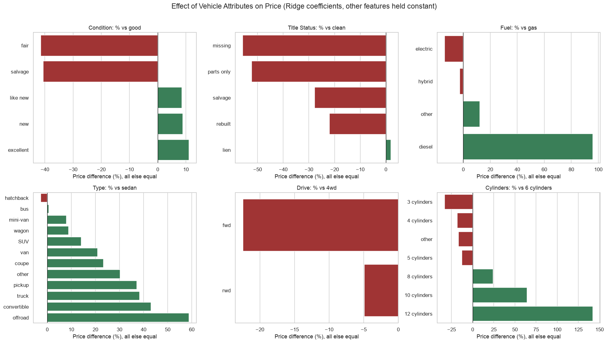

# What Drives the Price of a Car?

Practical Application II: finding what drives used car prices, with recommendations for a used car dealership.

**Notebook:** [used_car_price_drivers.ipynb](used_car_price_drivers.ipynb)

## Approach

* Cleaned 426K Kaggle listings down to about 249K by removing duplicates, fake prices and outliers.
* Compared Linear Regression, Ridge, Lasso and PCA + Linear Regression, tuned with grid search and 5-fold cross-validation.
* Used RMSE on log(price) as the metric, because it measures percent error.
* Chose **Ridge**. It explains about 78% of price differences and is off by about \$4,500 on average.

## Findings

* **Age:** biggest factor. Cars lose about 7% of value per year.
* **Mileage:** about 3–4% less per extra 10,000 miles.
* **Diesel:** about 2× the price of a similar gas car.
* **Trucks and pickups:** about 37% more than sedans. FWD is about 22% less than 4WD.
* **Brand:** Toyota, Lexus, Audi, Mercedes, Porsche and Tesla sell above Ford. Kia, Nissan and Hyundai sell below.
* **Title:** rebuilt or salvage titles cost 22–28%.
* **Paint color:** almost no effect.

## Recommendations and Next Steps

* Buy newer, lower-mileage cars.
* Stock trucks, SUVs, 4WD and diesel vehicles.
* Favor premium brands, and buy budget brands only at a discount.
* Avoid salvage and rebuilt titles unless they're much cheaper.
* Don't pay extra for paint color.
* Next: add model and trim data, and retrain on recent sale prices.
